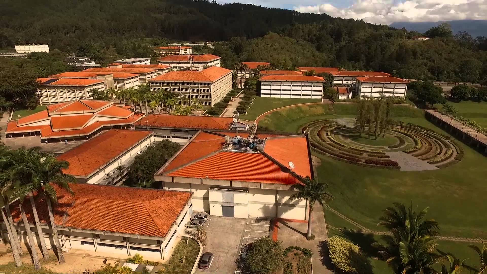

# Formato para elaboración de proyectos de grado de la Universidad Simón Bolívar siguiendo los lineamientos establecidos por el Decanato de Estudios Profesionales.
--------------------------------------------------------------------------------
## Autor

Luis Alejandro Pérez Bustos  
Electronic Engineering student at Simon Bolivar University  
2011 - 2017  
[LuisAlejandro.2702@gmail.com](mailto:LuisAlejandro.2702@gmail.com)  
[@LPerezBustos](https://twitter.com/LPerezBustos)  

## Justificación

## Características a considerar según los lineamientos del Decanato de Estudios Profesionales

- 
- 
- 
- 
- 
- 

## Consideraciones adicionales

- El *template* está subdividido en 4 partes: preámbulo, front-matter, main-matter y back-matter.
    - *Preámbulo*: paquetes por agregar y configuraciones necesarias.
    - *Front-Matter*: carátula, portada, acta de evaluación, resumen, dedicatoria, agradecimientos, lista de contenidos, lista de tablas, lista de figuras y lista de acrónimos y/o abreviaturas.
    - *Main-Matter*: introducción, capítulos y conclusiones.
    - *Back-Matter*: apéndices y referencias.
- El archivo *main.tex* establece la estructura general del proyecto.
- La lista de acrónimos se encuentra en el archivo *preambulo.tex*.
- El archivo *ref.bib* contiene las fuentes consultadas a lo largo del proyecto. La utilización de algún programa como *JabRef* o *Mendeley* puede ayudar a administrar de manera eficiente las referencias.

## Historial de cambios

### 08/04/2017 - Versión 1.0
- Primera versión luego de terminados los requisitos para obtener el título de *Ingeniero Electrónico* por parte de la Universidad Simón Bolívar.

## Basado en:

- PhD thesis LaTeX template for Cambridge University Engineering Department by Krishna Kumar [https://github.com/kks32/phd-thesis-template](https://github.com/kks32/phd-thesis-template)

## Agradecimientos:

- Krishna Kumar. Cambridge PhD Engineering Department template developper.
- Miguel Diaz. Profesor del Departamento de Electrónica y Circuitos de la Universidad Simón Bolívar.

